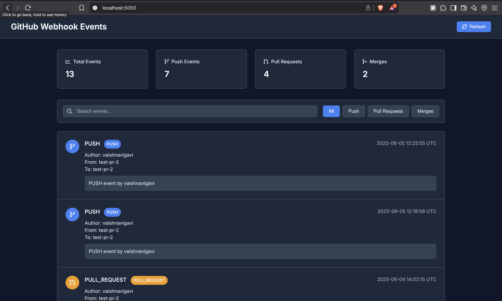

# GitHub Webhook Events Monitor

A real-time dashboard that monitors GitHub events (push, pull requests, and merges) using webhooks and displays them in a beautiful dark mode UI.



## Features

- 🎯 Real-time event monitoring
- 🌙 Modern dark mode UI
- 📊 Event statistics dashboard
- 🔍 Search and filter capabilities
- 📱 Responsive design
- 🔄 Auto-refresh every 15 seconds
- 🎨 Beautiful animations and transitions

## Prerequisites

- Python 3.8+
- MongoDB
- GitHub account
- ngrok (for local development)

## Setup Instructions

### 1. Clone the Repositories

```bash
# Clone the webhook server repository
git clone https://github.com/yourusername/webhook-repo.git
cd webhook-repo

# Clone the action repository
git clone https://github.com/yourusername/action-repo.git
cd action-repo
```

### 2. Set Up the Webhook Server

```bash
# Navigate to webhook-repo
cd webhook-repo

# Create and activate virtual environment
python -m venv venv
source venv/bin/activate  # On Windows: venv\Scripts\activate

# Install dependencies
pip install -r requirements.txt

# Start MongoDB (if not running)
mongod

# Start the Flask server
python app.py
```

### 3. Set Up ngrok for Local Development

```bash
# Install ngrok
brew install ngrok  # On macOS
# or download from https://ngrok.com/download

# Start ngrok tunnel
ngrok http 5050
```

### 4. Configure GitHub Repository

1. Go to your `action-repo` repository settings
2. Navigate to Secrets and Variables > Actions
3. Add the following secrets:
   - `WEBHOOK_URL`: Your ngrok URL + `/webhook` (e.g., `https://xxxx-xx-xx-xxx-xx.ngrok-free.app/webhook`)

### 5. Configure GitHub Actions

The workflow is already configured in `.github/workflows/webhook.yml`. It will:
- Trigger on push events
- Send webhook data to your Flask server
- Store events in MongoDB
- Display them in the UI

## Usage

1. Start the Flask server:
   ```bash
   cd webhook-repo
   source venv/bin/activate
   python app.py
   ```

2. Access the dashboard:
   - Open `http://localhost:5050` in your browser
   - The UI will auto-refresh every 15 seconds

3. Make changes to trigger events:
   - Push to any branch
   - Create a pull request
   - Merge a pull request

4. View events in the dashboard:
   - Total events count
   - Push events
   - Pull requests
   - Merges
   - Detailed event information

## UI Features

### Dashboard
- Real-time statistics
- Event type distribution
- Total event count

### Event List
- Chronological order
- Event type badges
- Author information
- Branch details
- Timestamps

### Search & Filter
- Search by author or branch
- Filter by event type
- Instant results

### Mobile Responsive
- Works on all devices
- Optimized layout
- Touch-friendly interface

## Troubleshooting

1. **Webhook not receiving events**
   - Check ngrok is running
   - Verify WEBHOOK_URL secret
   - Check GitHub Actions workflow

2. **Events not showing in UI**
   - Verify MongoDB connection
   - Check Flask server logs
   - Ensure correct ngrok URL

3. **UI not updating**
   - Check browser console
   - Verify auto-refresh interval
   - Try manual refresh

THANKYOU!